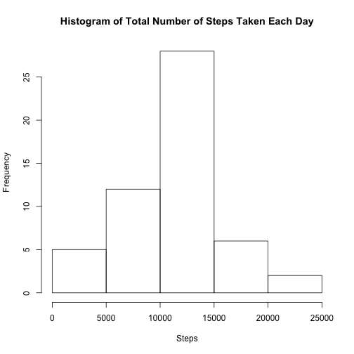
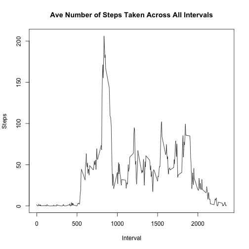
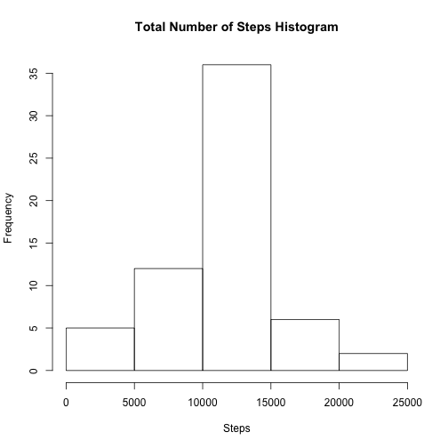
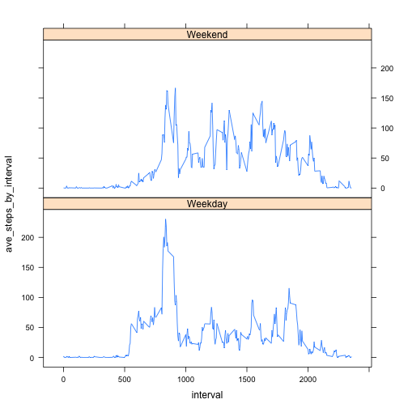

## Loading and preprocessing the data
Show any code that is needed to

- Load the data (i.e. read.csv())


```r
activity <- read.csv("~/Projects/CourseraDataScience/ReproducibleResearch/working/data/activity.csv", stringsAsFactors=FALSE)
```

- Process/transform the data (if necessary) into a format suitable for your analysis

```r
library("dplyr", lib.loc="/Library/Frameworks/R.framework/Versions/3.2/Resources/library")
steps.by.date <- activity %>% group_by(date) %>% summarise(total_steps = sum(steps))
```

## What is mean total number of steps taken per day?

For this part of the assignment, you can ignore the missing values in the dataset.

- Make a histogram of the total number of steps taken each day

```r
hist(steps.by.date$total_steps, xlab="Steps", main="Histogram of Total Number of Steps Taken Each Day")
```

 

- Calculate and report the mean and median total number of steps taken per day

```r
mean(steps.by.date$total_steps, na.rm = TRUE)
```

```
## [1] 10766.19
```

```r
median(steps.by.date$total_steps, na.rm = TRUE)
```

```
## [1] 10765
```


## What is the average daily activity pattern?

- Make a time series plot (i.e. type = "l") of the 5-minute interval (x-axis) and the average number of steps taken, averaged across all days (y-axis)

```r
steps.by.interval <- activity %>% group_by(interval) %>% summarize(ave_steps_by_interval = mean(steps, na.rm=TRUE))
plot(type="l", x=steps.by.interval$interval, y=steps.by.interval$ave_steps_by_interval, xlab="Interval", ylab="Steps", main="Ave Number of Steps Taken Across All Intervals")
```

 

- Which 5-minute interval, on average across all the days in the dataset, contains the maximum number of steps?

```r
filter(steps.by.interval, ave_steps_by_interval == max(ave_steps_by_interval)) %>% transmute(interval.with.max.steps = interval, no.of.steps = ave_steps_by_interval)
```

```
## Source: local data frame [1 x 2]
## 
##   interval.with.max.steps no.of.steps
##                     (int)       (dbl)
## 1                     835    206.1698
```
We can see that interval 835 has the max number of steps and it contains about 206 steps.

## Imputing missing values

Note that there are a number of days/intervals where there are missing values (coded as NA). The presence of missing days may introduce bias into some calculations or summaries of the data.

- Calculate and report the total number of missing values in the dataset (i.e. the total number of rows with NAs)

```r
nrow(activity) - nrow(activity[complete.cases(activity),])
```

```
## [1] 2304
```

- Devise a strategy for filling in all of the missing values in the dataset. The strategy does not need to be sophisticated. For example, you could use the mean/median for that day, or the mean for that 5-minute interval, etc.


*_I will use the average of each interval across days_*


- Create a new dataset that is equal to the original dataset but with the missing data filled in.

```r
replaceNAs <- function(activityDF) {
    rep.activityDF <- activityDF
    mean.steps.by.interval <- activity %>% group_by(interval) %>% summarize(ave_steps_by_interval = mean(steps, na.rm=TRUE))
    for (i in 1:length(rep.activityDF$steps)) {
        if (is.na(rep.activityDF$steps[i])) {
            int = rep.activityDF[i,]$interval
            rep.activityDF$steps[i] = mean.steps.by.interval[mean.steps.by.interval$interval == int,]$ave_steps_by_interval
        }
    }
    rep.activityDF
}

clean.activity <- replaceNAs(activity)
```


- Make a histogram of the total number of steps taken each day and Calculate and report the mean and median total number of steps taken per day. Do these values differ from the estimates from the first part of the assignment? What is the impact of imputing missing data on the estimates of the total daily number of steps?

```r
clean.steps.by.date <- clean.activity %>% group_by(date) %>% summarise(total_steps = sum(steps))
hist(clean.steps.by.date$total_steps, xlab="Steps", main="Total Number of Steps Histogram")
```

 

```r
mean(clean.steps.by.date$total_steps, na.rm = TRUE)
```

```
## [1] 10766.19
```

```r
median(clean.steps.by.date$total_steps, na.rm = TRUE)
```

```
## [1] 10766.19
```

For reference, here are the *prior* results for the data with missing values:

```r
mean(steps.by.date$total_steps, na.rm = TRUE)
```

```
## [1] 10766.19
```

```r
median(steps.by.date$total_steps, na.rm = TRUE)
```

```
## [1] 10765
```
The mean is unchanged since we used it to fill in the missing values. The median is slightly higher. 


We can also compare the total number of steps:

```r
sum(clean.steps.by.date$total_steps)
```

```
## [1] 656737.5
```

```r
sum(steps.by.date$total_steps, na.rm=TRUE)
```

```
## [1] 570608
```

The total daily number of steps is higher because we are removing NAs.


## Are there differences in activity patterns between weekdays and weekends?

For this part the weekdays() function may be of some help here. Use the dataset with the filled-in missing values for this part.

- Create a new factor variable in the dataset with two levels -- "weekday" and "weekend" indicating whether a given date is a weekday or weekend day.

```r
# create a new dataset adding the day of week 
day.activity <- mutate(clean.activity, day=weekdays(as.Date(clean.activity$date)))

#now figure out if its a weekday or weekend
daytype.activity <- mutate(day.activity, day_type=ifelse (day %in% c("Saturday", "Sunday"), "Weekend","Weekday"))

#make it a factor
daytype.activity$day_type <- as.factor(daytype.activity$day_type)
```

- Make a panel plot containing a time series plot (i.e. type = "l") of the 5-minute interval (x-axis) and the average number of steps taken, averaged across all weekday days or weekend days (y-axis).


```r
library("lattice", lib.loc="/Library/Frameworks/R.framework/Versions/3.2/Resources/library")
comparo <- daytype.activity %>% group_by(interval, day_type) %>% summarize(ave_steps_by_interval = mean(steps, na.rm=TRUE))
xyplot(ave_steps_by_interval ~ interval|day_type, type = "l", layout = c(1,2), comparo)
```

 

